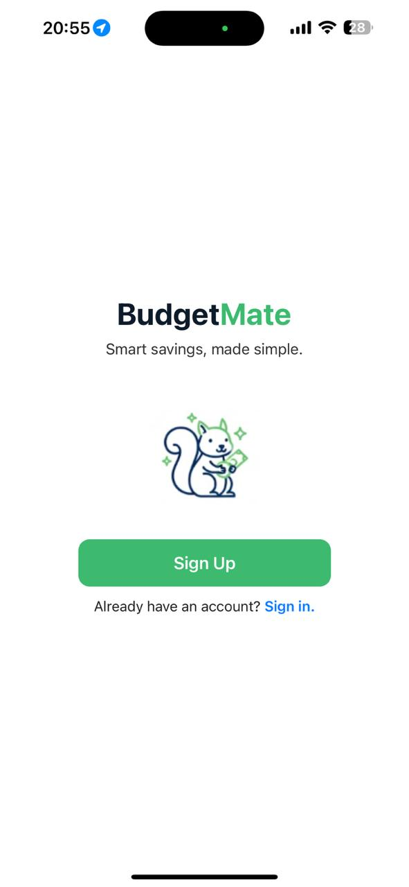
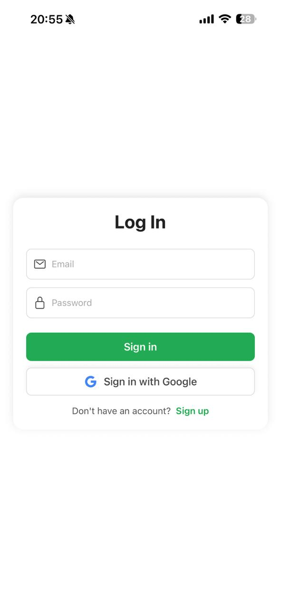
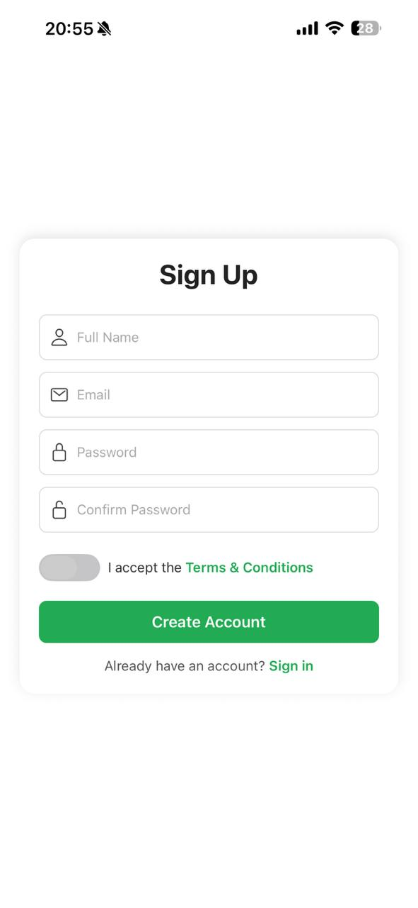
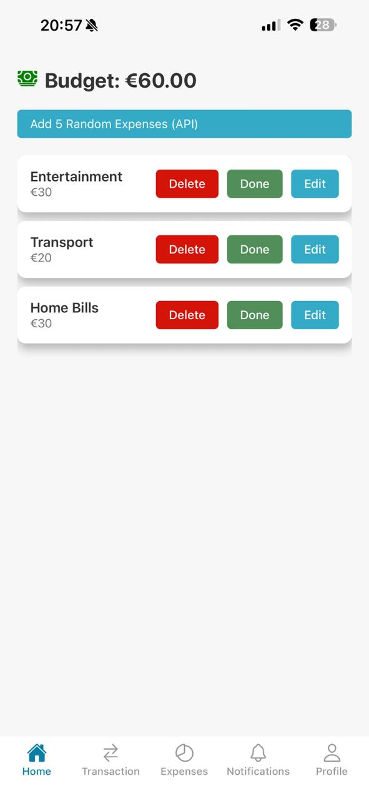
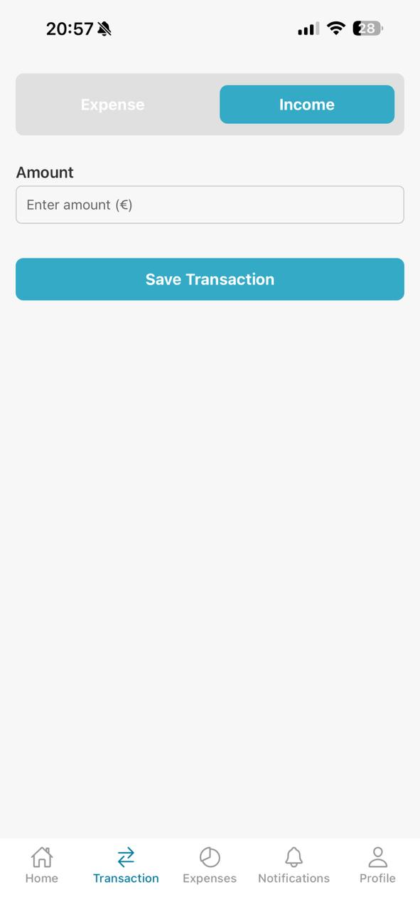
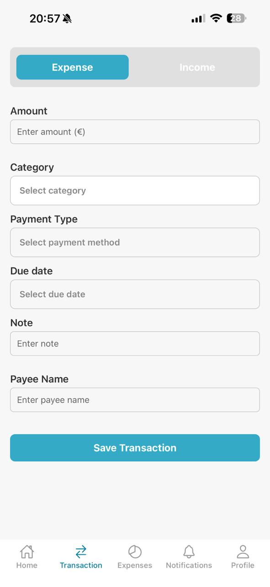
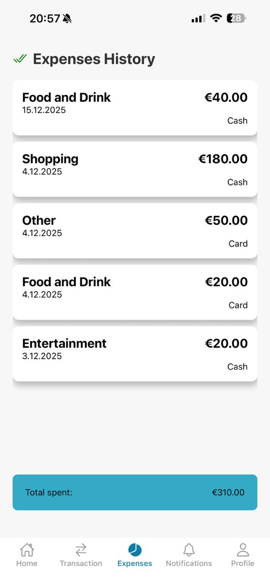
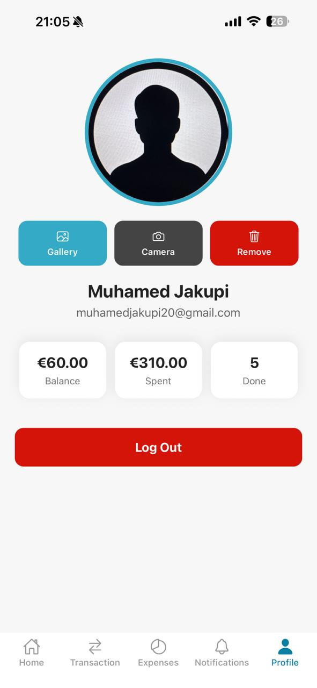
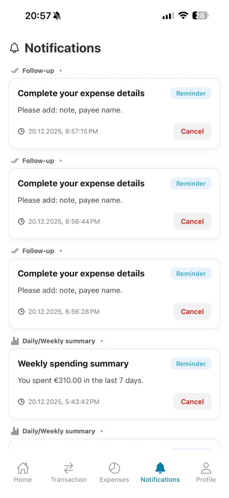

# Gr.20 - BudgetMate (Personal Budget Tracker)

A mobile application built with **React Native & Firebase** to help you manage your personal finances, track expenses, and monitor your budget effectively.

## 📱 About The Project

BudgetMate is a comprehensive budget tracking application that allows users to:

- **Create an account** and log in
- **Monitor current budget** on the homepage
- **Track pending expenses** with a clear overview
- **Add transactions** (both income and expenses)
- **Edit transactions**
- **Review completed expenses** and view total spending
- **Manage and personalize profile** information
- **See notifications** 

## ✨ Features

- 🔐 **User Authentication** - Sign Up, Log In and Google Sign In
- ☁️ **Cloud Database** - Firebase integration for storing user data and transactions securely
- 💰 **Budget Overview** - Real-time budget tracking on homepage
- 📋 **Expense Management** - Track pending and completed expenses
- ➕ **Transaction Management (CRUD)** - Users can **Create, Read, Update, Delete** income and expense transactions easily
- 🌐 **Random Task Generator** - Integration with an external API to generate random tasks for users
- 📊 **Financial Insights** - View total expenses and financial summary
- 🖼️ **Profile Personalization** – Users can take a photo, pick an image from gallery, or delete their profile picture
- 🔔 **Notifications System** – In-app notifications with a dedicated notifications screen
- 🎞️ **UI Animations** – Smooth animations for better user experience
- 🧪 **Testing** – Application tested using unit and component tests


## 🛠️ Built With

- **React Native** - Cross-platform mobile framework for Android and iOS
- **JavaScript / TypeScript** - Programming language
- **Firebase Authentication** - User login/signup including Google Sign-In
- **Firebase Firestore / Realtime Database** - Cloud database for storing user data, transactions, and budgets
- **React Navigation** - Handling app navigation between screens
- **React Native Animations** – UI animations and transitions
- **Testing Library / Jest** – Application testing

## 📄 Pages

### 🔹 App Screens Overview

<table align="center">
  <tr>
    <td align="center"><b>Entry</b></td>
    <td align="center"><b>Login</b></td>
    <td align="center"><b>Sign Up</b></td>
  </tr>
  <tr>
    <td></td>
    <td></td>
    <td></td>
  </tr>

  <tr>
    <td align="center"><b>Homepage</b></td>
    <td align="center"><b>Add Income</b></td>
    <td align="center"><b>Add Expense</b></td>
  </tr>
  <tr>
    <td></td>
    <td></td>
    <td></td>
  </tr>

  <tr>
    <td align="center"><b>Expenses History</b></td>
    <td align="center"><b>Profile</b></td>
    <td align="center"><b>Notifications</b></td>
  </tr>
  <tr>
    <td></td>
    <td></td>
    <td></td>
  </tr>
</table>


## 👥 Development Team

This project was developed by:
- **Dua Zogu**
- **Ledion Makolli** 
- **Muhamed Jakupi**
- **Rudina Bulliqi**
- **Viola Resyli**
- **Yllka Fejzullahu**

## 🚀 Getting Started

### Prerequisites

- Node.js
- React Native CLI
- npm or yarn

### Installation

1. Clone the repository
```bash
git clone https://github.com/Muhamedjakupi1/BudgetMate
cd budget-mate
```
2. Run command:
```bash
npm install
npx expo start
```
Thank you for using BudgetMate! Enjoy managing your finances 😊